<!-- TE-VERDE ANIMATED BANNER: tu foto en puntos -> taza -> tu foto -->
<a href="https://github.com/TeVerde29">
  <picture>
    <source media="(prefers-color-scheme: dark)" srcset="assets/banner-dark.v9.svg">
    <source media="(prefers-color-scheme: light)" srcset="assets/banner-light.v9.svg">
    
  </picture>
</a>

 

---

### Estudiante de Ingeniería de Sistemas | Desarrollo de Software
**Frontend · Backend · APIs · Bases de Datos · Automatización**

---

## Sobre mí

Estudiante de **Ingeniería de Sistemas (IX ciclo)** en la **Universidad Nacional de Ucayali**, con experiencia práctica en **desarrollo de software, integración frontend–backend y automatización de pruebas**.

Me interesa construir soluciones orientadas a problemas reales, desde aplicaciones web y APIs hasta herramientas de escritorio y sistemas de optimización.

Actualmente trabajo principalmente con **Angular + Node.js + MySQL y Java + Springboot + MySQL** y también tengo experiencia con bases de datos, testing funcional, automatización y desarrollo bajo metodologías ágiles.

---

## `$ cat tech-stack.yaml`

<table border="1" cellpadding="14" bgcolor="#101F16">
  <thead>
    <tr>
      <th colspan="2" align="left"><code>teverde29:~$ cat tech-stack.yaml</code></th>
    </tr>
  </thead>
  <tbody>
    <tr>
      <td width="50%" valign="top"><code>├─ ✦ languages:</code>  
         
        <code>Java · Python · TypeScript · JavaScript · SQL</code>
      </td>
      <td width="50%" valign="top"><code>├─ ◉ frontend:</code>  
         
        <code>Angular · HTML · CSS · Figma</code>
      </td>
    </tr>
    <tr>
      <td valign="top"><code>├─ ⚙ backend_apis:</code>  
        
         
        <code>Node.js · Spring Boot · Postmant · Swagger</code>
      </td>
      <td valign="top"><code>├─ ▣ databases:</code>  
        
         
        <code>MySQL · SQL Server</code>
      </td>
    </tr>
    <tr>
      <td valign="top"><code>├─ ◎ desktop_optimizacion:</code>  
          
        <code>Electron </code>
      </td>
      <td valign="top"><code>╰─ ⌁ testing_tools:</code>  
         
        <code>Selenium· Docker · Scrum</code>
      </td>
    </tr>
  </tbody>
  <tfoot>
    <tr>
      <td colspan="2"><code>status: open-to-work&nbsp;&nbsp;·&nbsp;&nbsp;environment: production</code></td>
    </tr>
  </tfoot>
</table>

---

## Áreas de interés

**Desarrollo de Software**
Aplicaciones web, APIs y herramientas de escritorio.

**Backend & Datos**
Diseño de APIs REST, integración frontend–backend y bases de datos.

**Testing & Automatización**
Pruebas funcionales, validación de sistemas y automatización.

**Algoritmos y Optimización**
Resolución de problemas y desarrollo de soluciones orientadas a procesos reales.

---

## GitHub Stats

---

<!-- SOCIALS -->
## `$ connect --socials`

 

### ¿Quieres conocer mis proyectos?

Explora mis repositorios o contáctame mediante [LinkedIn](https://www.linkedin.com/in/pedro-giovanni-ricra-figueroa-971a20433) o [Email](mailto:pedro.ricra.figueroa@gmail.com).
