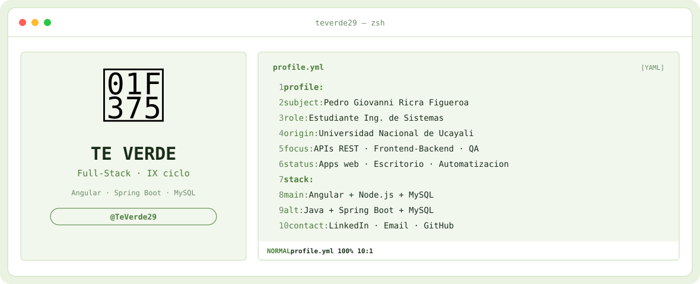
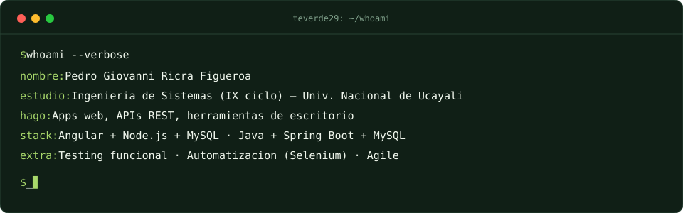

<!-- TE-VERDE BANNER -->
<a href="https://github.com/TeVerde29">
  <picture>
    <source media="(prefers-color-scheme: dark)" srcset="assets/banner-dark.svg">
    <source media="(prefers-color-scheme: light)" srcset="assets/banner-light.svg">
    
  </picture>
</a>

 

---

## `$ whoami`

  

 

## `$ cat tech-stack.yaml`

<table border="1" cellpadding="14" bgcolor="#0F1F16">
  <thead>
    <tr>
      <th colspan="2" align="left"><code>teverde29:~$ cat tech-stack.yaml</code></th>
    </tr>
  </thead>
  <tbody>
    <tr>
      <td width="50%" valign="top"><code>├─ ✦ languages:</code>  
         
         
        <code>Java · Python · C++ · TS · JS · SQL</code>
      </td>
      <td width="50%" valign="top"><code>├─ ◉ frontend:</code>  
         
        <code>Angular · HTML · CSS · Figma</code>
      </td>
    </tr>
    <tr>
      <td valign="top"><code>├─ ⚙ backend_apis:</code>  
        
         
        <code>Node.js · Spring Boot · Postman · Swagger</code>
      </td>
      <td valign="top"><code>├─ ▣ databases:</code>  
        
         
        <code>MySQL · SQL Server</code>
      </td>
    </tr>
    <tr>
      <td valign="top"><code>├─ ◎ testing_qa:</code>  
        
        
         
        <code>Selenium · Jupyter · Colab</code>
      </td>
      <td valign="top"><code>╰─ ⌁ tools:</code>  
         
        <code>Git · GitHub · Docker · Electron · VS Code</code>
      </td>
    </tr>
  </tbody>
  <tfoot>
    <tr>
      <td colspan="2"><code>status: open-to-work&nbsp;&nbsp;·&nbsp;&nbsp;environment: production</code></td>
    </tr>
  </tfoot>
</table>

---

## `$ cat about.txt`

Estudiante de **Ingeniería de Sistemas (IX ciclo)** en la **Universidad Nacional de Ucayali**, con experiencia práctica en **desarrollo de software, integración frontend–backend y automatización de pruebas**.

Me interesa construir soluciones orientadas a problemas reales, desde aplicaciones web y APIs hasta herramientas de escritorio y sistemas de optimización.

Actualmente trabajo principalmente con **Angular + Node.js + MySQL y Java + Spring Boot + MySQL** y también tengo experiencia con bases de datos, testing funcional, automatización y desarrollo bajo metodologías ágiles.

**Áreas de interés:** Desarrollo de Software · Backend & Datos (APIs REST, integración frontend–backend, BD) · Testing & Automatización (pruebas funcionales, validación) · Algoritmos y Optimización.

---

## `$ stats --all`

  <picture>
    <source media="(prefers-color-scheme: dark)" srcset="assets/radar-dark.svg">
    <source media="(prefers-color-scheme: light)" srcset="assets/radar-light.svg">
    
  </picture>&nbsp;
  <picture>
    <source media="(prefers-color-scheme: dark)" srcset="assets/radar-langs-dark.svg">
    <source media="(prefers-color-scheme: light)" srcset="assets/radar-langs-light.svg">
    
  </picture>

<code>signals: fullstack_skill_radar · language_stack_radar · status: healthy</code>

---

<!-- SOCIALS -->
## `$ connect --socials`

&nbsp;&nbsp;
&nbsp;&nbsp;

  

### ¿Quieres conocer mis proyectos?

Explora mis repositorios o contáctame mediante [LinkedIn](https://www.linkedin.com/in/pedro-giovanni-ricra-figueroa-971a20433) o [Email](mailto:pedro.ricra.figueroa@gmail.com).

 
 

Hecho con 🍵 y mucho té verde desde Perú · @TeVerde29
 
Regenera los radares con: <code>python scripts/radar.py --data assets/skills.json -o assets/radar</code>

